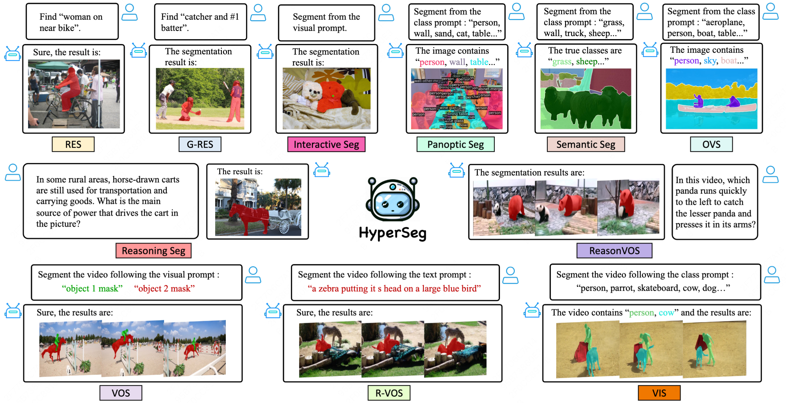
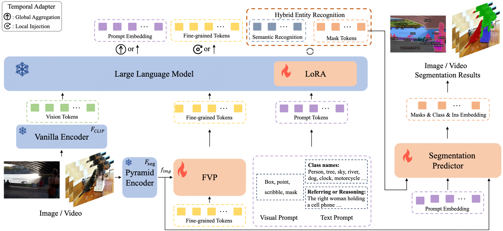

# HyperSeg: Towards Universal Visual Segmentation with Large Language Model
Cong Wei, Yujie Zhong, Haoxian Tan, Yong Liu, Zheng Zhao, Jie Hu, and Yujiu Yang

> #### Cong Wei, Yujie Zhong<sup>&dagger;</sup>, Haoxian Tan, Yong Liu, Zheng Zhao, Jie Hu, and Yujiu Yang<sup>&dagger;</sup>
>
> <sup>&dagger;</sup>Correspondence

[Paper](https://arxiv.org/abs/2411.17606)


[](https://paperswithcode.com/sota/referring-expression-segmentation-on-refcoco?p=hyperseg-towards-universal-visual)
[](https://paperswithcode.com/sota/referring-expression-segmentation-on-refcoco-8?p=hyperseg-towards-universal-visual)
[](https://paperswithcode.com/sota/referring-expression-segmentation-on-refcoco-9?p=hyperseg-towards-universal-visual)
[](https://paperswithcode.com/sota/referring-expression-segmentation-on-refcoco-3?p=hyperseg-towards-universal-visual)
[](https://paperswithcode.com/sota/referring-expression-segmentation-on-refcoco-4?p=hyperseg-towards-universal-visual)
[](https://paperswithcode.com/sota/referring-expression-segmentation-on-refcoco-5?p=hyperseg-towards-universal-visual)
[](https://paperswithcode.com/sota/referring-expression-segmentation-on-refcocog?p=hyperseg-towards-universal-visual)
[](https://paperswithcode.com/sota/referring-expression-segmentation-on-refcocog-1?p=hyperseg-towards-universal-visual)
[](https://paperswithcode.com/sota/referring-video-object-segmentation-on-refer?p=hyperseg-towards-universal-visual)
[](https://paperswithcode.com/sota/referring-expression-segmentation-on-davis?p=hyperseg-towards-universal-visual)
[](https://paperswithcode.com/sota/panoptic-segmentation-on-coco-minival?p=hyperseg-towards-universal-visual)
[](https://paperswithcode.com/sota/semantic-segmentation-on-coco-1?p=hyperseg-towards-universal-visual)
[](https://paperswithcode.com/sota/open-vocabulary-semantic-segmentation-on-1?p=hyperseg-towards-universal-visual)
[](https://paperswithcode.com/sota/open-vocabulary-semantic-segmentation-on-5?p=hyperseg-towards-universal-visual)


<p align="center">
 
</p>


## 📖 Abstract
This paper aims to address universal segmentation for image and video perception with the strong reasoning ability empowered by Visual Large Language Models (VLLMs). Despite significant progress in current unified segmentation methods, limitations in adaptation to both image and video scenarios, as well as the complex reasoning segmentation, make it difficult for them to handle various challenging instructions and achieve an accurate understanding of fine-grained vision-language correlations. We propose HyperSeg, the first VLLM-based universal segmentation model for pixel-level image and video perception, encompassing generic segmentation tasks and more complex reasoning perception tasks requiring powerful reasoning abilities and world knowledge. Besides, to fully leverage the recognition capabilities of VLLMs and the fine-grained visual information, HyperSeg incorporates hybrid entity recognition and fine-grained visual perceiver modules for various segmentation tasks. Combined with the temporal adapter, HyperSeg achieves a comprehensive understanding of temporal information. Experimental results validate the effectiveness of our insights in resolving universal image and video segmentation tasks, including the more complex reasoning perception tasks.


## 📖 Pipeline
<p align="center">
 
</p>


## Installation
Install required packages. 

```bash
conda create -n HyperSeg python=3.10.13
conda activate HyperSeg
conda install pytorch==1.13.1 torchvision==0.14.1 torchaudio==0.13.1 -c pytorch -c conda-forge -y
pip install -r requirements.txt
```


## Pre-trained weights

### Mipha
HyperSeg needs loading Mipha-3B pre-trained weights [Mipha-3B](https://huggingface.co/zhumj34/Mipha-3B).
### Mask2Former weights
The Segmentation Predictor requires loading Mask2Former Swin-B weights [Mask2Former](https://dl.fbaipublicfiles.com/maskformer/mask2former/coco/panoptic/maskformer2_swin_base_IN21k_384_bs16_50ep/model_final_54b88a.pkl).


## Getting Started

See [Preparing Datasets for HyperSeg.](docs/DATASET.md)

See [Running Inference with HyperSeg.](docs/INFERENCE.md)


## Citation 
If you find this project useful in your research, please consider citing:

```
@article{wei2024hyperseg,
  title={HyperSeg: Towards Universal Visual Segmentation with Large Language Model},
  author={Wei, Cong and Zhong, Yujie and Tan, Haoxian and Liu, Yong and Zhao, Zheng and Hu, Jie and Yang, Yujiu},
  journal={arXiv preprint arXiv:2411.17606},
  year={2024}
}
```

## Acknowledgement
-  Thanks for great works of [Mask2Former](https://github.com/facebookresearch/Mask2Former), [PSALM](https://github.com/zamling/PSALM) and [Mipha](https://github.com/zhuyiche/llava-phi). Our code is based on them.


